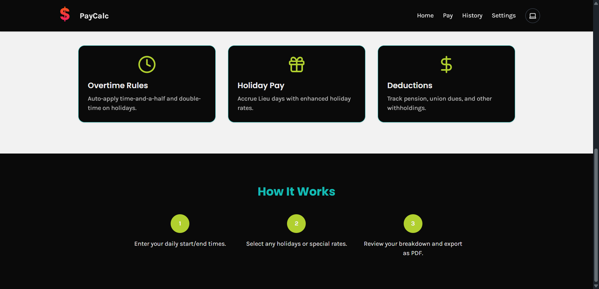

# PayCalc

PayCalc is a web-based pay estimator built with Next.js and TypeScript. It helps shift employees forecast their weekly pay by calculating regular hours, overtime, premiums and common deductions. Results can be printed, saved or downloaded as a PDF.



## Features

- Real-time calculation of regular, overtime and holiday pay
- Night shift, weekend and weekend OT premiums
- Optional bump pay when scheduled hours are not met
- Lieu day accrual and pay when used
- Deduction estimates for pension, union dues, CPP, EI and tax
- Save each week's entry to MongoDB and view a history of saved weeks
- Edit saved entries or load them back into the calculator
- Light/dark theme toggle and offline capable Progressive Web App
- Print results or download a PDF pay stub
- Basic-auth protected admin console

## Requirements

- **Node.js** 18+
- **npm** 8+ (or Yarn)
- Running MongoDB instance
- Modern browser such as Chrome, Firefox or Edge

Create a `.env.local` file and provide the following variables:

```env
MONGODB_URI=mongodb://localhost:27017/paycalc
ADMIN_USER=admin
ADMIN_PASSWORD=secret
# Optional pay rates
REGULAR_RATE=32.5
PENSION_BIWEEKLY=103.79
UNION_DUES_WEEKLY=98
```

## Installation

```bash
# Clone the repository
git clone <repository-url>
cd pay-calculator

# Install dependencies
npm install
```

### Run the app

```bash
npm run dev
```

Open [http://localhost:3000](http://localhost:3000) and navigate to **/pay** to access the calculator.

## Usage

1. Enter your scheduled and actual times for each day then click **Calculate**.
2. Review the breakdown, print the results or download them as a PDF.
3. Saved weeks can be found under **History** and reloaded for editing.
4. Admin pages under `/admin` require the credentials from `.env.local`.

### Production build

```bash
npm run build
npm start
```

## Contributing

Contributions are welcome! Fork the repo and open a pull request.

## License

MIT

